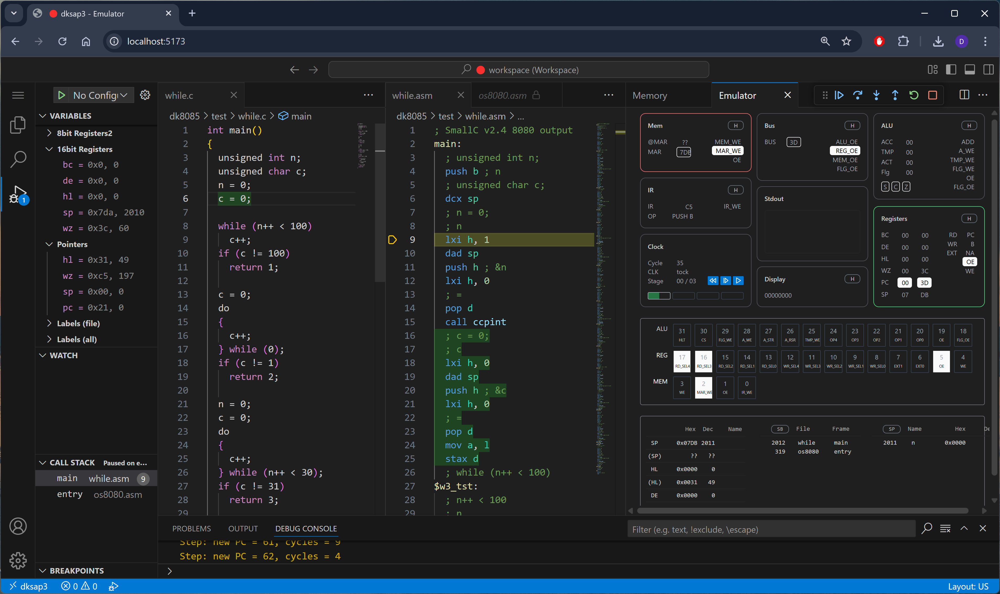

# dksap3 - an IDE for Simple As Possible CPU v3



## Features

1. 8080/5 assembly language server (Langium) with assembler and debugger
2. SAP3 CPU clock level simulator (adapted from Austin Morlan's verilog)

## Planned

1. SmallC language server (WIP)
2. SmallC compiler (WIP)

## Installation

```sh
npm install
npm run prepare
npm run dev
```

## Acknowledgements

1. https://austinmorlan.com/posts/fpga_computer_sap3/
2. https://langium.org/
3. https://github.com/TypeFox/monaco-languageclient
4. https://github.com/ncb85/SmallC-85
5. https://github.com/c-testsuite/c-testsuite
